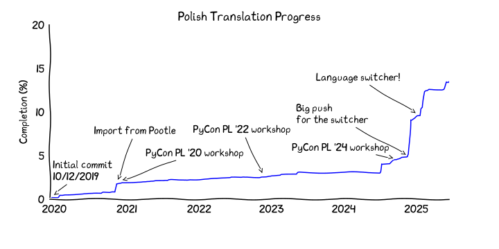

Polish Translation of Python Documentation
==========================================
<!-- [[[cog
from manage_translation import get_resource_language_stats, progress_from_resources, language_switcher

stats = get_resource_language_stats()
core_words, _ = progress_from_resources(list(filter(language_switcher, stats)))
total_words, total_strings = progress_from_resources(stats)

print(
f'''

''')
]]] -->

<!-- [[[end]]] -->

*Przeczytaj to w innym języku: [polski](README.md)*

**I found a mistake, what do I do?**

If you find a mistake or have a suggestion,
[let us know](https://github.com/python/python-docs-pl/issues) or fix it yourself:

* Go to the website of the project [Python Documentation](https://explore.transifex.com/python-doc/python-newest/).
* Click the button "Join this project", to join the Project.
* Create an account on Transifex.
* On the project website pick the language Polish.
* After joining the Project, pick the category you want to fix/translate.

You can find more information about using Transifex
in [their help articles](https://help.transifex.com/en/articles/6318216-translating-with-the-web-editor) or [our guide](https://python-docs-transifex-automation.readthedocs.io/new-translators.html).

**I want to start translating, but I don't know where to start!**

Firstly, you can join as a translator by following the steps outlined above.

Then you can start by translating one of our [prioritized resources](https://github.com/python/python-docs-pl/issues/50).

**How to see the newest build of the documentation?**

Download the latest build from the list of artefacts in the latest GitHub Action (Actions Tab).
Translations are pulled from Transifex around every half hour.
The documentation at https://docs.python.org/pl/ is updated around once daily.

**Communication Channels**

* [Discord Python Polska #dokumentacja](https://discord.gg/QB3h2Sxc)
* [Python Documentation Community](https://docs-community.readthedocs.io/)
* [Python translations mailing list](https://mail.python.org/mailman3/lists/translation.python.org/)
* [Python Documentation Special Interest Group](https://www.python.org/community/sigs/current/doc-sig/)

**Translation progress**

<!---
Excludes the changelog from calculations.
Made using: https://gist.github.com/StanFromIreland/ce400e0d497018fc8e8eb6b739e0b8eb
--->

**License**

By inviting you to work on a project on the Transifex platform, we offer a contract for
donating your translations to the Python Software Foundation
[under the CC0 license](https://creativecommons.org/publicdomain/zero/1.0/deed.pl).
In return, it will be visible that you are the translator of the part you translated.
You signify your acceptance of this agreement by submitting your work for inclusion in the documentation.

**Updating Translations**
* `./manage_translation.py recreate_tx_config`
* `./manage_translation.py fetch`
* `cog -rP README.md`

**Useful Materials**
* [Python Developer's Guide: Translating](https://devguide.python.org/documentation/translations/translating/)
* [Python docs Transifex: Documentation](https://python-docs-transifex-automation.readthedocs.io/)
* [Site Statistics](https://analytics.python.org/docs.python.org?f=contains,page,/pl/)

**Similar Translation Projects**
* [Projects of the Python Packaging Authority](https://hosted.weblate.org/projects/pypa/-/pl/)
* [Scientific Python Translations](https://scientific-python-translations.github.io/)
* [micro:bit translation programme](https://microbit.org/translate/)
* [Localizing Django](https://docs.djangoproject.com/en/dev/internals/contributing/localizing/)
