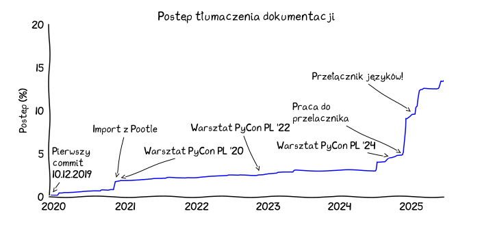

Polskie tłumaczenie dokumentacji Pythona
========================================
<!-- [[[cog
from manage_translation import get_resource_language_stats, progress_from_resources, get_number_of_translators

stats = get_resource_language_stats()
total_words, total_strings = progress_from_resources(stats)
translators = get_number_of_translators()

print(
f'''

''')
]]] -->

<!-- [[[end]]] -->

*Read this in another language: [English](README.en.md)*

**Znalazłem błąd, co mam zrobić?**

Jeśli znalazłeś(-aś) błąd lub masz sugestię,
[dodaj zgłoszenie](https://github.com/python/python-docs-pl/issues) w tym projekcie lub
napraw go sam(a):

* Wejdź na stronę
projektu [dokumentacji Pythona](https://explore.transifex.com/python-doc/python-newest/).
* Naciśnij przycisk „Join this project”, aby dołączyć do projektu.
* Utwórz konto Transifex.
* Na stronie projektu wybierz język polski.
* Po dołączeniu do zespołu wybierz zasób, który chcesz poprawić/zaktualizować.

Więcej informacji o używaniu Transifeksa znajdziesz w
[jego artykułach pomocy](https://help.transifex.com/en/articles/6318216-translating-with-the-web-editor) lub [w naszym przewodniku](https://python-docs-transifex-automation.readthedocs.io/new-translators.html).

**Chcę pomóc w tłumaczeniu, ale nie wiem od czego zacząć!**

Najpierw dołącz do projektu jako tłumacz, postępując zgodnie z przewodnikiem w poprzedniej sekcji.

Następnie możesz zacząć od tłumaczenia jednego z naszych [priorytetowych zasobów.](https://github.com/python/python-docs-pl/issues/50)

**Jak obejrzeć najnowszy build dokumentacji?**

Pobierz ostatnią zbudowaną dokumentację z listy artefaktów w ostatniej GitHub Action (zakładka Actions).
Tłumaczenia pobierane są z Transifeksa do tego repozytorium co około pół godziny.
Dokumentacja na https://docs.python.org/pl/ aktualizowana jest około raz dziennie.

**Kanały komunikacji**

* [Discord Python Polska #dokumentacja](https://discord.gg/VCyBDGH38e)
* [Python Documentation Community](https://docs-community.readthedocs.io/en/latest/)
* [Python translations mailing list](https://mail.python.org/mailman3/lists/translation.python.org/)
* [Python Documentation Special Interest Group](https://www.python.org/community/sigs/current/doc-sig/)

**Postęp tłumaczenia**

<!---
Excludes the changelog from calculations.
Made using: https://gist.github.com/StanFromIreland/ce400e0d497018fc8e8eb6b739e0b8eb
--->

**Licencja**

Zapraszając do współtworzenia projektu na platformie Transifex, proponujemy umowę na
przekazanie twoich tłumaczeń Python Software Foundation
[na licencji CC0](https://creativecommons.org/publicdomain/zero/1.0/deed.pl).
W zamian będzie widoczne, że jesteś tłumaczem(-ką) części, którą przetłumaczyłeś(-łaś).
Wyrażasz akceptację tej umowy przesyłając swoją pracę do włączenia do dokumentacji.

**Aktualizacja tłumaczeń**
* `./manage_translation.py recreate_tx_config`
* `./manage_translation.py fetch`
* `cog -rP README.md`

**Przydatne materiały**
* [Python Developer's Guide: Translating](https://devguide.python.org/documentation/translations/translating/)
* [Python docs Transifex: Documentation](https://python-docs-transifex-automation.readthedocs.io/)
* [statystyki oglądalności](https://analytics.python.org/docs.python.org?f=contains,page,/pl/)

**Podobne projekty**
* [projekty Python Packaging Authority](https://hosted.weblate.org/projects/pypa/-/pl/)
* [Scientific Python Translations](https://scientific-python-translations.github.io/)
* [Localizing Django](https://docs.djangoproject.com/en/dev/internals/contributing/localizing/)
