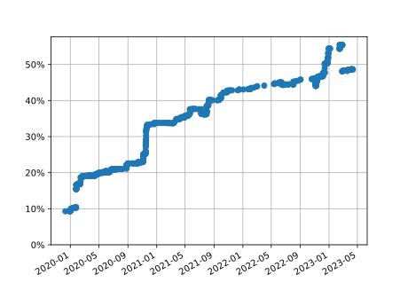

Polskie tłumaczenie dokumentacji Pythona
========================================
<!-- [[[cog
from manage_translation import get_resource_language_stats, progress_from_resources, language_switcher, get_number_of_translators

stats = get_resource_language_stats()
switcher = progress_from_resources(filter(language_switcher, stats))
total = progress_from_resources(stats)
translators = get_number_of_translators()

print(
f'''

''')
]]] -->

<!-- [[[end]]] -->

Jeśli znalazłeś(-aś) błąd lub masz sugestię,
[dodaj zgłoszenie](https://github.com/python/python-docs-pl/issues) w tym projekcie lub
napraw go sam(a):

* Wejdź na stronę
projektu [dokumentacji Pythona](https://explore.transifex.com/python-doc/python-newest/).
* Naciśnij przycisk „Join this project”, aby dołączyć do projektu.
* Utwórz konto Transifex.
* Na stronie projektu wybierz język polski.
* Po dołączeniu do zespołu, wybierz zasób, który chcesz poprawić/zaktualizować.

Więcej informacji o używaniu Transifeksa znajdziesz w
[jego dokumentacji](https://docs.transifex.com/getting-started-1/translators).

**Postęp tłumaczenia**

Język polski pojawi się w przełączniku języków na docs.python.org,
[kiedy w pełni przetłumaczone będą](https://www.python.org/dev/peps/pep-0545/#add-translation-to-the-language-switcher):
* `bugs`,
* wszystkie zasoby z katalogu `tutorial`,
* `library/functions`.

**Jak obejrzeć najnowszy build dokumentacji?**

Pobierz ostatnią zbudowaną dokumentację z listy artefaktów w ostatniej GitHub Action (zakładka Actions).
Tłumaczenia pobierane są z Transifeksa do tego repozytorium co około pół godziny.
Dokumentacja na python.org aktualizowana jest około raz dziennie.

**Kanały komunikacji**

* [python-docs-pl Discord](https://discord.gg/3faJmGKhta)
* [Python translations working group](https://mail.python.org/mailman3/lists/translation.python.org/)
* [Python Documentation Special Interest Group](https://www.python.org/community/sigs/current/doc-sig/)

**Licencja**

Zapraszając do współtworzenia projektu na platformie Transifex, proponujemy umowę na
przekazanie twoich tłumaczeń Python Software Foundation
[na licencji CC0](https://creativecommons.org/publicdomain/zero/1.0/deed.pl).
W zamian będzie widoczne, że jesteś tłumaczem(-ką) części, którą przetłumaczyłeś(-łaś).
Wyrażasz akceptację tej umowy przesyłając swoją pracę do włączenia do dokumentacji.

**Aktualizacja tłumaczeń**
* `./manage_translation.py recreate_tx_config`
* `./manage_translation.py fetch`
* `cog -rP README.md`

**Potencjalnie przydatne materiały**
* [polskie tłumaczenie dokumentacji Pythona 2.3](https://pl.python.org/docs/).
